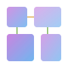

 

#  Craft

A domain-specific language for modeling business use cases and domain interactions, with powerful visualization capabilities for domain-driven design and C4 architecture diagrams.

## 🚧 v2.0 Development Status

Craft is currently under active development, representing a complete transformation from architecture description to business use case modeling.

## What is Craft?
Craft is a complete reimagining of architecture description language, shifting from static architecture documentation to dynamic use case modeling. It enables teams to:

- Model business use cases as the primary unit of system design
- Capture domain interactions through scenario-based descriptions
- Generate visual diagrams including domain flows, C4 diagrams, and sequence diagrams
- Align with Domain-Driven Design principles and practices
- Support event-driven architectures with async/sync action modeling

A domain-specific language for modeling use cases, domains, and services with automatic diagram generation.

## Example

```
services {
    UserService: {
        domains: Authentication, Profile
        data-stores: user_db
        language: golang
    }
}

use_case "User Registration" {
    when Business_User creates Account
        Authentication validates email format
        Authentication asks Database to check email uniqueness
        Profile creates user profile
        Authentication notifies "User Registered"

    when Profile listens "User Registered"
        Profile asks Database to store profile data
        Profile asks Notifier to send welcome email
}
```

## Language Syntax
### Services Definition
Services group related domains into deployable units and specify their technology stack:

```
services {
  ServiceName: {
    domains: Domain1, Domain2, Domain3
    data-stores: database_name, cache_name
    language: golang
  },
  "Service with Spaces": {
    domains: AnotherDomain
    data-stores: another_db
    language: python
  }
}
```

### Use Cases
Use cases capture business scenarios through triggers and domain actions:

```
use_case "Use Case Name" {
  when trigger_condition
    domain_action_1
    domain_action_2
    
  when another_trigger  
    more_actions
}
```
### Trigger Types
#### External Triggers - Initiated by actors:
```
when user submits registration
when admin approves request  
when customer places order
```
#### Event Triggers - Initiated by domain events:
```
when "Order Placed"
when "User Verified"
```
#### Domain Listener Triggers - Domains responding to events:
```
when PaymentService listens "Order Created"
when Notification listens "User Registered"
```
#### Scheduled Triggers - CRON or time-based:
```
when CRON processes daily reports
when CRON identifies expired sessions
```

### Action Types
#### Synchronous Actions - Direct domain-to-domain calls:
```
Authentication asks Database to verify credentials
PaymentService asks BankAPI to process payment
Inventory asks Warehouse to check availability
```

#### Asynchronous Actions - Event publishing:
```
OrderService notifies "Order Placed"
Authentication notifies "User Logged In"  
PaymentService notifies "Payment Processed"
```

#### Internal Actions - Domain internal operations:
```
Profile creates user record
Inventory updates stock levels
Notification sends welcome email
```

## VS Code Extension
The Craft VS Code extension is now available as a standalone project:

🔗 **[Craft Language VS Code Extension](https://github.com/tcarcao/craft-vscode-extension)**

Features include:
- **Syntax highlighting** and language server support
- **Domain & Services tree views** with real-time discovery
- **Live diagram previews** (C4, domain, sequence diagrams)
- **Use case selection and filtering**
- **Cross-file domain reference tracking**

Install from [GitHub releases](https://github.com/tcarcao/craft-vscode-extension/releases) by downloading the `.vsix` file.

## Examples
See the [./examples](examples) directory for some DSL examples:

- Banking System - Financial services with fraud detection
- User Management - Simple authentication and profile management

## Building

### Prerequisites
- Go 1.22+

### Build Steps
```bash

# Generate ANTLR parser code
make docker-build-antlr-image generate-grammar

# Build the project
make docker-build

# Run the project
make docker-run

# Run tests
make test
```

## Previous Versions

`[v1]` - Architecture Description DSL

- Component and relationship modeling
- Basic C4 diagram generation
- Simple VS Code extension
- **Status:** Deprecated