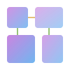

#  Craft

A domain-specific language for modeling business use cases and domain interactions, with automatic generation of C4, domain-flow, and sequence diagrams.

**[Documentation](https://tcarcao.github.io/craft/)** · [Examples](examples/) · [VS Code Extension](https://github.com/tcarcao/craft-vscode-extension)

---

## Install

```bash
brew install tcarcao/craft/craft-cli
```

Verify:

```bash
craft-cli --help
```

---

## Quick example

```craft
actors {
    user Customer
    service Database
}

domain Order {
    Cart
    Checkout
    Payment
}

services {
    OrderService {
        contexts: Cart, Checkout, Payment
        data-stores: order_db
        language: golang
        deployment: rolling
    }
}

use_case "Purchase Item" {
    when Customer adds item to cart
        Cart validates item availability
        Cart notifies "Item Added to Cart"

    when Checkout listens "Item Added to Cart"
        Checkout asks Payment to process payment
        Payment notifies "Payment Processed"
}
```

Run `craft-cli validate`, `craft-cli generate`, or `craft-cli inspect` on any `.craft` file. See the [CLI reference](https://tcarcao.github.io/craft/tooling/cli).

---

## VS Code Extension

The [Craft VS Code extension](https://github.com/tcarcao/craft-vscode-extension) adds syntax highlighting, domain/services tree views, and live diagram previews. Install from [GitHub releases](https://github.com/tcarcao/craft-vscode-extension/releases).

---

## Claude Code skill

If you use [Claude Code](https://claude.ai/code), install the Craft skill to get AI assistance for writing and extending `.craft` files:

```bash
npx skills add tcarcao/craft
```

The skill teaches Claude the full grammar, modeling patterns, and event-driven choreography conventions. See the [skill docs](https://tcarcao.github.io/craft/tooling/skill).

---

## Examples

See [examples/](examples/) for complete models:

- **Banking system** — financial services with fraud detection
- **User management** — authentication and profile management

---

## Development

### Prerequisites

- Go 1.22+
- Docker or Podman

### Build

```bash
# First-time setup — pulls ANTLR image and regenerates parser
make fresh-setup

# Build and run the server
make docker-build && make docker-run

# Run tests
make test
```

### Grammar changes

The ANTLR grammar lives in `tools/antlr-grammar/Craft.g4`. Generated parser code in `pkg/parser/` is gitignored — regenerate with:

```bash
make generate-grammar
```

---

## License

MIT
